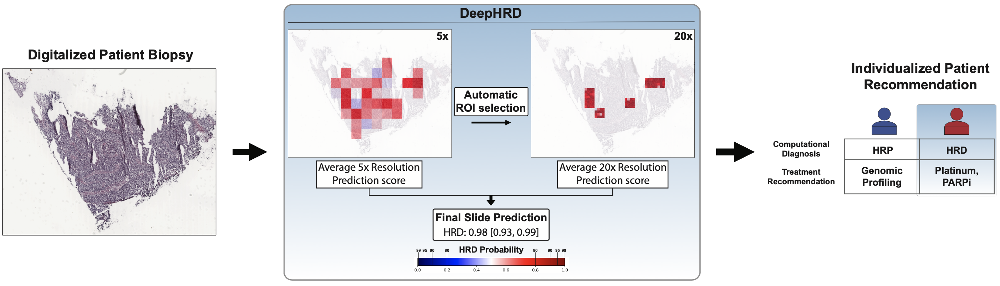

# DeepHRD
Deep learning predicts HRD and platinum response from histology slides in breast and ovarian cancer

[medRxiv](https://www.medrxiv.org/content/10.1101/2023.02.23.23285869v1.full-text) | [Citation](#citation) | [License](#license)



## Introduction

DeepHRD is a deep learning convolutional neural network architecture trained to detect genomic signatures of homologous recombination deficiency (HRD) in breast and ovarian 
cancers using histopathological tissue slides from tumor tissue. The model is built upon fundamental assumptions of multiple instance learning (MIL) using a two-stage model.
In the first stage, DeepHRD makes an initial classification of a tissue slide at a 5x resolution (2mpp) using only informative regions of the tissue by removing background 
regions and performing a stain normalization on the image. Next, the model automatically subsamples regions of interest (ROI) at the 5x resolution and resamples each ROI at 
a 20x resolution (0.5mpp). In the second stage, these newly samples ROIs are used to train a second multiple-instance model. Lastly, the finaly predictions from the 5x model 
and the 20x models are averaged to arrive at a final prediction for a given patient. 

When generating a prediction for a given slide, DeepHRD incorporates dropout within the fully connected layers of each model as a bayesian approximation representing the model's
uncertainty. Thus, for each tissue slide, it is recommended to run inference with multiple repetitions (--BN_reps >10) to generate a distribution of prediction scores. 
This will provide confidence intervals in the final scoring for any given patient/slide.

DeepHRD encompasses three separately trained models to perform inference. Each model can be specified when running the inference module:

* Breast cancer - FFPE (--modelType breast_ffpe)
* Breast cancer - Flash frozen (--modelType breast_flash_frozen)
* Ovarian cancer - Flash frozen (--modelType ovarian_flash_frozen)

## Pipeline


For specifics on how the models were trained, tested, and externally validated, please see our online preprint [citation](#citation).

## Prerequisites
The framework is written in Python; however, it also requires the following software and infrastructure:

* Python version 3.6 or newer
* Pytorch (tested on torch>=1.13.1)
* Openslide
* NVIDIA GPU (tested on M60s via AWS EC2 instances and A100s on a custom cluster. Testing included the use of single GPUs as well as multiple GPUs in parallel)
* See requirements.txt for a full list of Python packages used during training and testing.


## Prediction
Instructions to perform a prediction on a single image or collection of images using one of the pre-trained models for breast or ovarian cancer:
1. [THIS IS NOT CURRENTLY SUPPORTED] - Download the relevant pre-trained model. See [Parameters](#parameters) for a list of possible models under the --modelType argument.
```bash
$ python3 install_model --modelType breast_ffpe
```
2. Use the DeepHRD_predict.py script to perform the prediction. This script will handle all preprocessing and iteratie through the complete [pipeline](#pipeline).
 See [optional parameters](#optional-or-custom-to-each-run) for a complete list of each step. The raw whole-slide images should be placed under your project path within a folder 
that matches your project name (i.e. if --projectPath /your/project/path/ and --project BRCA; then place the images within the path /your/project/path/BRCA/).
```bash
python3 DeepHRD_predict.py --projectPath /your/project/path/ --project yourProjectNameSuchAsBRCA --output /your/output/path/  --model /path/to/models/ --workers 16 --BN_reps 10 --reportVerbose --preprocess --stainNorm --generateDataSets --predict5x --pullROIs --predict20x --predictionMasks
```
The final prediction results will be saved under the provided output path with the file prefix (DeepHRD_report...csv). Prediciton results for the 5x and 20x models are saved
separately within the same output path with the prefix (predictions_...csv).

If --predictionMasks is provided, the 5x and 20x prediction masks are saved as PDFs within the following path: /path/to/output/probability_masks/.


### Testing using a custom model
See [Testing the new model](#testing-the-new-model)


## Training a new model
Instructions for training a new model separate from the pre-trained models provided in the base package.
1. Determine specifics for the training (i.e. maximum training epochs, dropout rate, number of gpus to use if available, number of workers/cpus to use, number of ensemble models, etc.)
See [all available parameters](#parameters) for training/testing a model below.
2. Use the DeepHRD_train.py script to train the desired ensemble models. 
```bash
python3 DeepHRD_train.py --projectPath /your/project/path/ --project yourProjectNameSuchAsBRCA --output /your/output/path/ --metadata /path/to/your/metadatafile.txt --ensemble 5 --dropoutRate 0.5 --stainNorm --generateDataSets --train5x --calcFeatures --pullROIs --train20x --workers 16 --epochs 200
```


### Testing the new model
Instructions to perform a prediction on a single image or collection of images using a newly trained model. This process is similar to the base [prediction](#prediction) with
several modificiations:
1. After training a new ensemble of models:
	a. Create a new models directory. 
	b. Move your desired checkpoint models to this models directory and name each file based on the resolution and the ensemble model number (i.e. 5x_m1.pth checkpoint model 
	specifies the 1st ensemble model at 5x resolution). If there are 2 ensemble models in total trained, there should be a 5x_m1.pth, 5x_m2.pth, 20x_m1.pth, and 20x_m2.pth model.
	c. Determine the custom threshold for the binary classification (i.e. --customThreshold 0.5).
2. Use the DeepHRD_predict.py script to perform the prediction while specifying the new --model /path/to/new/models/ and --customThreshold 0.5
```bash
python3 DeepHRD_predict.py --projectPath /your/project/path/ --project yourProjectNameSuchAsBRCA --output /your/output/path/  --model /path/to/new/trained/models/ --customThreshold 0.5 --workers 16 --BN_reps 10 --reportVerbose --preprocess --stainNorm --generateDataSets --predict5x --pullROIs --predict20x --predictionMasks
```

## Data Format
### Meta data file format
General format for providing the metadata file to the train or prediction script. The file required the set headers found below that include "slide", "patient", 
"label", and "partition". The softLabel column is required when providing the --softLabel flag when running the predict or train script. All samples should be 
pre-partitioned into a train, validation, and test set. We recommend using a train:val:test split of 70:15:15. This file should be saved as a tab-separated text
file. 

| slide | patient | label | softLabel | subtype | partition |
| ----- | ----- | --- | --- | ----- | --- |
| TCGA-A1-A0SE-01A-01-BS1.bc41fb6d-f6a5-495c-b429-80d289f0bda1.svs | TCGA-A1-A0SE | 21.0 | 0.39875 | Luminal A | test |


## Parameters
### Required
| Category | Parameter | Variable Type | Description |
| ------ | ----------- | ----------- | ----------- |
| Train/Predict |  |  |  |
|  | projectPath | String | Path to the project directory. |
|  | project | String | Project Name where the slides are located. projectPath + project should be the location to the slides. |
|  | output | String | Path to where the output and predictions are saved. Recommended projectPath + "output/" |
|  | metadata | String | Path to the metadata file that contains the labels for each sample. | 
| Predict |  |  |  |
|  | model | String | Path to the pretrained models. |
|  | modelType | String | Specify the trained model for testing. |


### Optional or custom to each run
| Category | Parameter | Variable Type | Description |
| ------ | ----------- | ----------- | ----------- |
| Train/Predict |  |  |  |
|  | preprocess | store_true-Flag | Preprocess, filter, and tile WSI. |
|  | generateDataSets | store_true-Flag | Generate the initial 5x datasets. |
|  | pullROIs | store_true-Flag | Pull regions of interest using each 5x model. | 
|  | tileOverlap | Float | The proportion of overlap between adjacenet tiles during preprocessing. |
|  | stainNorm | store_true-Flag | Normalize the staining colors.|
|  | batch_size | Integer | How many tiles to include for each mini-batch. |
|  | workers | Integer | Number of data loading workers. |
|  | BN_reps | Integer | Number of MonteCarlo iterations to perform for bayesian network estimation. |
|  | max_gpu | Integer | Number of gpus to use. |
|  | max_cpu | Integer | Maximum number of CPUs to utilize for parallelization. |
|  | ensemble | Integer | Number of ensemble models to test. |
|  | dropoutRate | Float | Rate of dropout to be used within the fully connected layers. Can be used for both prediction and training. |
|  | maxROI | Integer | Number of maximum ROIs that can be selected. | 
|  | python | String | Specify the python version command for internal system commands if it is not python3. |
| Predict |  |  |  |
|  | predict5x | store_true-Flag | Run inference for a 5x ensemble model. |
|  | predict20x | store_true-Flag | Run inference for a 20x ensemble model. | 
|  | predictionMasks | store_true-Flag | Generate prediction masks for each tissue sample. |
|  | customThreshold | Float | Threshold to use if running inference on custom models. |
|  | reportVerbose | store_true-Flag | Print final report to standard out once complete. |
| Train |  |  |  |
|  | softLabel | store_true-Flag | Use soft labeling for target labels (i.e. float between [0,1]). |
|  | checkpointModel | String | Complete path to a pretrained model; either a checkpoint or for transfer learning. |
|  | train5x | store_true-Flag | Train a 5x ensemble model. |
|  | train20x | store_true-Flag | Train a 20x ensemble model. |
|  | calcFeatures | store_true-Flag | Generate tile feature vectors for each 5x model. |
|  | best5xModels | Integer - accepts multiple values | Provide a list of best models to use for the 5x training (Use the epoch number; i.e. checkpoint_best_5x_150.pth would be model 150). You should provide 1 value per ensemble model (i.e. ensemble of 5 models should have 5 model numbers. Default will use the final saved checkpoints after training the 5x model. |
|  | epochs | Integer | Number of training epochs. |


## Citation

Bergstrom EN, Abbasi A, Diaz-Gay M, Ladoire S, Lippman SM, and Alexandrov LB (2023) Deep learning predicts homologous recombination deficiency and platinum response from histology slides in breast and ovarian cancers. [medRxiv](https://www.medrxiv.org/content/10.1101/2023.02.23.23285869v1).

## License
Academic Software License: © 2022 University of California, San Diego (“Institution”). Academic or nonprofit researchers are permitted to use this Software (as defined below) subject to Paragraphs 1-4:

1.	Institution hereby grants to you free of charge, so long as you are an academic or nonprofit researcher, a nonexclusive license under Institution’s copyright ownership interest in this software and any derivative works made by you thereof (collectively, the “Software”) to use, copy, and make derivative works of the Software solely for educational or academic research purposes, and to distribute such Software free of charge to other academic or nonprofit researchers for their educational or academic research purposes, in all cases subject to the terms of this Academic Software License. Except as granted herein, all rights are reserved by Institution, including the right to pursue patent protection of the Software.

2.	Any distribution of copies of this Software -- including any derivative works made by you thereof -- must include a copy (including the copyright notice above), and be made subject to the terms, of this Academic Software License; failure by you to adhere to the requirements in Paragraphs 1 and 2 will result in immediate termination of the license granted to you pursuant to this Academic Software License effective as of the date you first used the Software.

3.	IN NO EVENT WILL INSTITUTION BE LIABLE TO ANY ENTITY OR PERSON FOR DIRECT, INDIRECT, SPECIAL, INCIDENTAL, OR CONSEQUENTIAL DAMAGES, INCLUDING LOST PROFITS, ARISING OUT OF THE USE OF THIS SOFTWARE, EVEN IF INSTITUTION HAS BEEN ADVISED OF THE POSSIBILITY OF SUCH DAMAGE. INSTITUTION SPECIFICALLY DISCLAIMS ANY AND ALL WARRANTIES, EXPRESS AND IMPLIED, INCLUDING, BUT NOT LIMITED TO, ANY IMPLIED WARRANTIES OF MERCHANTABILITY AND FITNESS FOR A PARTICULAR PURPOSE. THE SOFTWARE IS PROVIDED “AS IS.” INSTITUTION HAS NO OBLIGATION TO PROVIDE MAINTENANCE, SUPPORT, UPDATES, ENHANCEMENTS, OR MODIFICATIONS OF THIS SOFTWARE.

4.	Any academic or scholarly publication arising from the use of this Software or any derivative works thereof will include the following acknowledgment:  The Software used in this research was created by Alexandrov Lab of University of California, San Diego. © 2022 University of California, San Diego.
